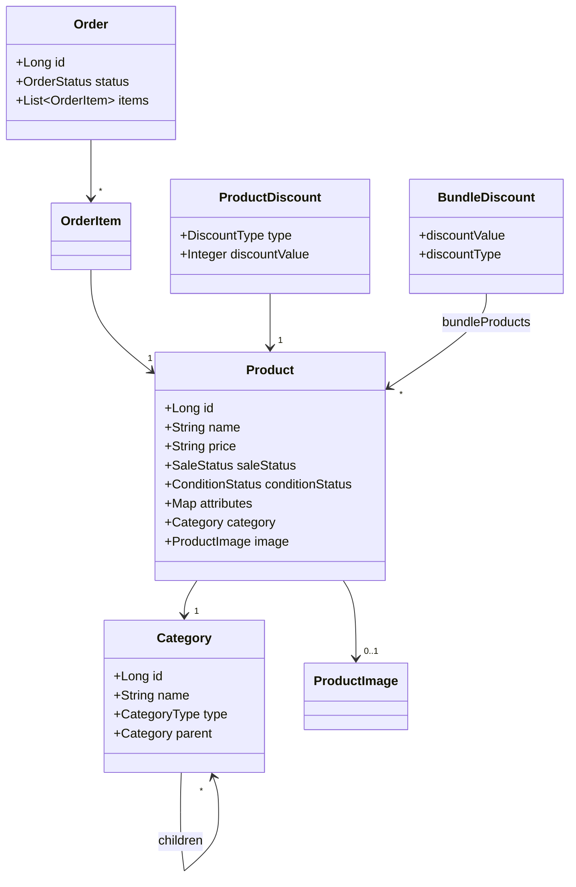

# Product Microservice

> **Purpose** – Manages **product catalogue**, **category hierarchy**, **discount rules**, and **order intake** for the OrderHub platform.

This service exposes REST APIs for product & order management and publishes domain events so that other services (inventory, payment, fulfilment, media‑storage, etc.) can react asynchronously.

---

## ✨ Key Features

* **Products**
  Create, read, update, soft‑delete.  Supports JSON‑formatted **attributes** (`jsonb`) and rich **image** metadata.
* **Categories**
  Three‑level tree: `MAJOR → MIDDLE → MINOR`.  Validates parent/child constraints at domain level.
* **Discounts**
  \- *ProductDiscount* (per‑item, threshold‑price)
  \- *BundleDiscount* (set of products)
  \- *OrderDiscount* (cart‑wide)
* **Orders**
  Add / update / cancel items, automatic status roll‑up (`PENDING → PROCESSING → SHIPPED`).
* **Event‑Driven Integration**
  Publishes Kafka topics when products or orders change (`product‑updated`, `order‑created`, …).  A **ProductCreatedEvent** triggers the Image service to persist uploaded pictures.

---

## 🏗️ Tech Stack

| Layer          | Technology                                                                |
| -------------- |---------------------------------------------------------------------------|
| Runtime        | **Java 21**, Spring Boot 3                                                 |
| Persistence    | Spring Data JPA + Hibernate, **PostgreSQL** (JSONB via *hibernate‑types*) |
| Messaging      | **Apache Kafka** (spring‑kafka)                                           |
| Build / DevOps | Gradle 8, Docker & Docker Compose                                         |
| Testing        | JUnit 5, Testcontainers                                                   |

---

## ⚙️ Architecture

```
┌────────────┐       REST/JSON        ┌───────────────┐
│   Client   │  ───────────────────▶ │ Product API   │
└────────────┘                       │  Controller   │
                                     └──────┬────────┘
                                            ▼
                                   ┌──────────────────┐
                                   │ Application      │
                                   │ Service Layer    │
                                   └──────┬───────────┘
                                            ▼
                                   ┌──────────────────┐
                                   │ Domain Model     │
                                   └──────┬───────────┘
   Kafka      ▲  product‑updated            ▼            ▲  DB
 Topics  ◀────┘                        ┌──────────────┐  └──▶ PostgreSQL
                                      │ Repository   │
                                      └──────────────┘
```

* Clean layering keeps HTTP, business rules, and persistence concerns separate.
* Domain entities enforce invariants (e.g. `MINOR` categories cannot own children, `BundleDiscount#appliesTo()` equality match, etc.).
* `@PrePersist/@PreUpdate` populate **auditing** fields (`createdAt`, `updatedAt`).

---

## 📚 Domain Model Highlights



---

## 🔌 REST API Sketch

> **Base path**  `/api`

| Method | Path                | Description                                        |
| ------ | ------------------- | -------------------------------------------------- |
| GET    | `/products`         | Paged query (filter by category, status, keyword…) |
| GET    | `/products/deleted` | Soft‑deleted items                                 |
| GET    | `/products/{id}`    | Single product detail                              |
| POST   | `/products`         | Create product (multipart upload for image)        |
| PATCH  | `/products/{id}`    | Update mutable fields                              |
| DELETE | `/products/{id}`    | Soft delete (sets `SaleStatus.DELETED`)            |
| POST   | `/orders`           | Create order with line items                       |
| PATCH  | `/orders/{id}`      | Update quantities / add items                      |
| DELETE | `/orders/{id}`      | Cancel order                                       |

Controllers are deliberately omitted from the code snippet, but follow standard Spring MVC patterns.

---

## 🚀 Getting Started

### Prerequisites

* JDK 17+
* Docker & Docker Compose (*for Postgres + Kafka*)

### 1 – Clone & Build

```bash
git clone https://github.com/orderhub/product-service.git
cd product-service
gradle clean build -x test  # skip tests first run
```

### 2 – Start Infrastructure

```bash
docker compose up -d postgres kafka zookeeper
```

### 3 – Run Service

```bash
SPRING_PROFILES_ACTIVE=local \
DB_HOST=localhost DB_PORT=5432 DB_USER=orderhub DB_PASS=secret \
KAFKA_BOOTSTRAP=localhost:9092 \
java -jar build/libs/product-service-*.jar
```

Service will be available at **[http://localhost:8080](http://localhost:8080)**.

---

## 🛠️ Configuration

| Property                          | Default                                     | Description                     |
| --------------------------------- | ------------------------------------------- | ------------------------------- |
| `spring.datasource.url`           | `jdbc:postgresql://localhost:5432/orderhub` | Postgres JDBC URL               |
| `spring.kafka.bootstrap-servers`  | `localhost:9092`                            | Kafka brokers                   |
| `orderhub.topics.product-updated` | `product-updated`                           | Topic for product update events |
| `orderhub.topics.order-created`   | `order-created`                             | Topic for new orders            |

Secrets can be overridden via **environment variables** (`DB_PASS`, etc.).

---

## 🧪 Testing

```bash
gradle test               # unit tests
TESTCONTAINERS=true gradle integrationTest  # spin up ephemeral Postgres & Kafka
```

---

## 📦 Deployment

A container image is built with **Jib**:

```bash
gradle jibDockerBuild
```

Push to registry & deploy via Kubernetes Helm chart under `deploy/`.

---

## 📝 Contributing

1. Fork & create feature branch `feat/<name>`
2. Commit following Conventional‑Commits
3. Open PR, describing **why** + **what**
4. Await CI ✅ & review.

---

## © 2025 OrderHub
